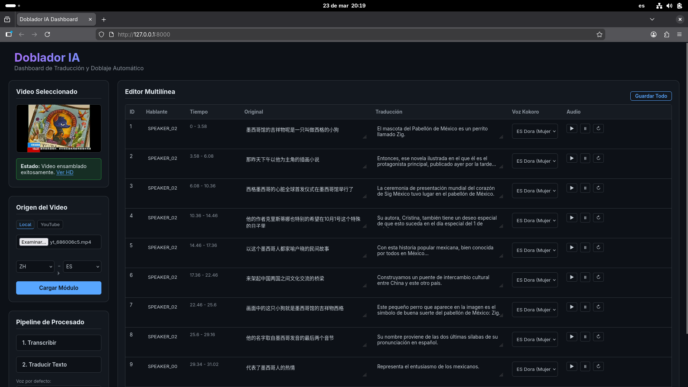

# 🎙️ AI Video Dubbing (Traductor IA)



An application that automates the video translation and dubbing process. It uses an asynchronous FastAPI backend and a web dashboard to transcribe, translate, generate voiceovers, and assemble the final video while preserving the original background music.

## Features

- **YouTube Integration**: Download and process videos using `yt-dlp`.
- **Transcription**: Audio recognition with `faster-whisper`.
- **Speaker Diarization**: Identifies and separates different speakers using `pyannote.audio`.
- **Audio Separation**: Isolates vocals from background music or SFX using `demucs`.
- **Neural Translation**: Text translation using the `demonbyron/HY-MT1.5-7B` model via Ollama.
- **Voice Synthesis (TTS)**: Multi-language voice generation with `kokoro`.
- **Interactive Editor**: Web interface to edit translations, change voices, and regenerate audio by segment.
- **Video Assembly**: Audio mixing and hybrid synchronization (audio/video) using FFmpeg.

## Technologies

- **Backend**: Python 3.12, FastAPI, Uvicorn
- **Local LLM**: Ollama
- **Audio & Machine Learning**: `faster-whisper`, `pyannote.audio`, `kokoro`, `demucs`, `torch`, `soundfile`
- **Video Processing**: FFmpeg
- **Frontend**: HTML5, Vanilla JavaScript, CSS3

## Hardware Requirements & Performance

The application is highly optimized to run locally without requiring enterprise-grade hardware. As a reference, the following specifications yield excellent results in reasonable timeframes for both transcription (English/Chinese) and voice generation:

- **CPU**: Intel Core i5 (11th Gen) or equivalent
- **RAM**: 32 GB 
- **GPU (VRAM)**: 4 GB

*Node:* The system features dynamic fallback mechanisms. If the GPU runs out of memory (VRAM), the app automatically flushes the cache and falls back to CPU/RAM processing. This means that even with 4GB VRAM, you can smoothly process long videos in technically complex languages using advanced models (like `large-v3`) without encountering fatal crash errors.

## Installation

⚠️ **Important**: You must have the full version of `ffmpeg` installed (with `libx264` support), `ollama` installed, and your chosen translation model running.

```bash
git clone https://github.com/YourUsername/traductor_IA.git
cd traductor_IA

# Create and activate a virtual environment
python3 -m venv venv
source venv/bin/activate

# Install dependencies
pip install -r requirements.txt
```

### System Dependencies (FFmpeg)
**Fedora** (Requires enabling RPM Fusion):
```bash
sudo dnf install --nogpgcheck https://mirrors.rpmfusion.org/free/fedora/rpmfusion-free-release-$(rpm -E %fedora).noarch.rpm https://mirrors.rpmfusion.org/nonfree/fedora/rpmfusion-nonfree-release-$(rpm -E %fedora).noarch.rpm
sudo dnf swap ffmpeg-free ffmpeg --allowerasing
```

**Debian/Ubuntu**:
```bash
sudo apt-get install ffmpeg
```

## Usage

To start the application, run the included startup script:
```bash
chmod +x start.sh
./start.sh
```

Or start the server manually:
```bash
uvicorn app:app --reload
```
Once started, open your browser and navigate to `http://localhost:8000`.

## Advanced Configuration

For instructions on how to modify internal models (like Whisper `large-v3`), adjust transcription parameters, or tweak the translation prompts, please read the [Advanced Usage Guide](ADVANCED_USAGE.md).

## Contributions

Contributions are welcome! Feel free to open an *Issue* to report bugs or synchronization issues, or submit a *Pull Request* to propose code improvements.

## License

This project is licensed under the **GNU Affero General Public License v3.0 (AGPLv3)**. See the `LICENSE` file for more details.

## Disclaimer

This project is strictly for educational purposes. The author is not responsible for the misuse of the information, provided code, or generated voices. Use at your own risk.
